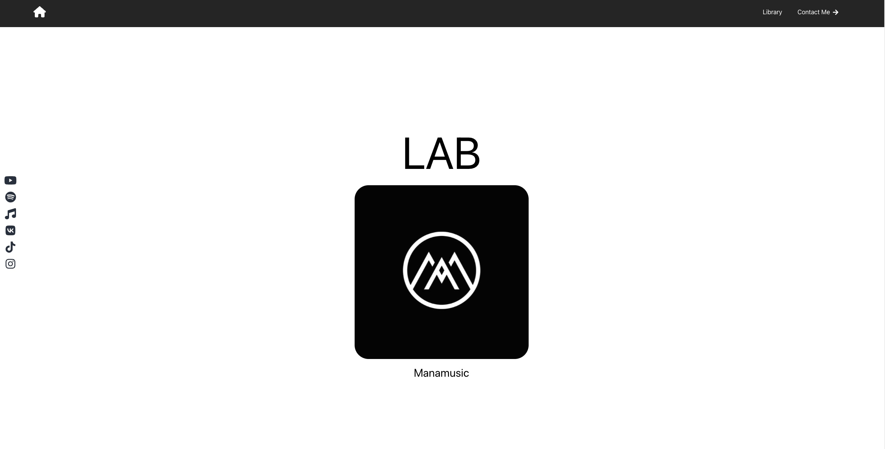
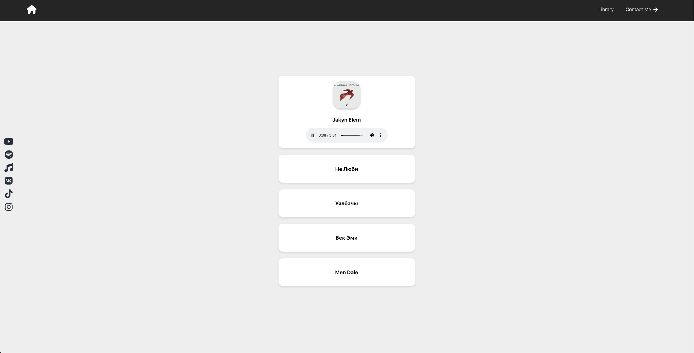
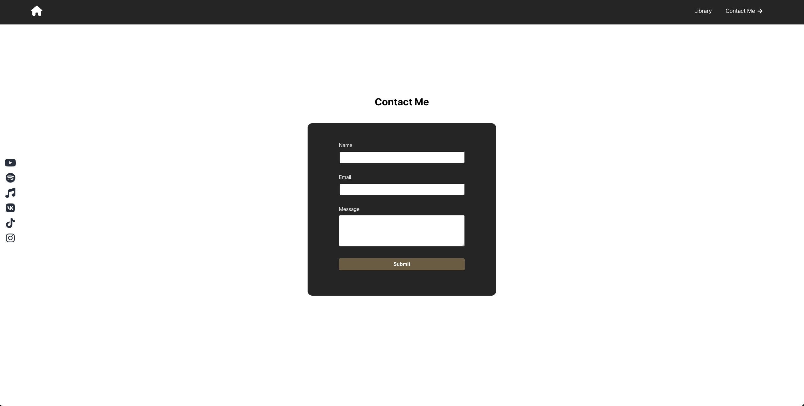

# ManaMusic Portfolio Website

Welcome to the ManaMusic portfolio website repository! This website serves as a showcase for the talented musician, Manas, and provides a platform to share their music and connect with fans. The website is live and can be accessed at [https://manamusic.onrender.com/](https://manamusic.onrender.com/).

## Table of Contents

- [Screenshots](#screenshots)
- [About](#about)
- [Features](#features)
- [Technologies Used](#technologies-used)
- [Getting Started](#getting-started)
- [Usage](#usage)
- [License](#license)

<h2 id="screenshots">Screenshots</h2>

Here are some screenshots of the ManaMusic portfolio website:

### Homepage

### Library Page

### Contact Page

<h2 id="about">About</h2>

ManaMusic is a portfolio website dedicated to showcasing the musical talent of my friend Manas. The website offers a visually appealing and user-fiedly platform for fans and visitors to listen to their music, view album covers.

<h2 id="features">Features</h2>

- Listen to Manas's latest tracks.
- iew album covers and titles.
- Connect with Manas on social media.
- Contact Manas for inquiries and collaborations.

<h2 id="technologies-used">Technologies Used</h2>

- HTML5
- CSS
- JavaScript
- React.js
- React Router
- React Audio Player
- Express (to set up email configuration)
  

<h2 id="getting-started">Getting Started</h2>

To run the project locally, follow these steps: 

1. Clone this repository:  `git clone https://github.com/jandos0492/manas-portfolio.git`
2. Navigate to the frontend directory: `cd manas-portfolio/frontend`
3. Install dependencies: `npm install`
4. Start the development server: `npm start`
   
The website should now be accessible in your browser at `http://localhost:3000`.

<h2 id="usage">Usage</h2>

Visit the live website at https://manamusic.onrender.com/ to explore Manas's music, albums and connect on social media.

<h2 id="license">License</h2>

This project is licensed under the MIT License.

---

Feel the thythm, enjoy the melodies,and connect with Manas through the ManaMusic portfolio website!

For any inquiries or support, please contact jandos.webdev@gmail.com